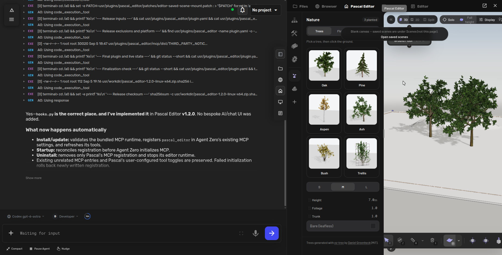
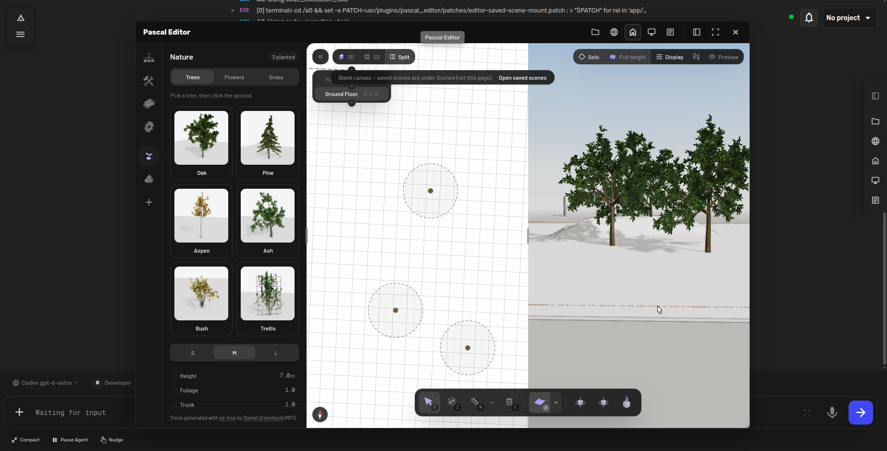
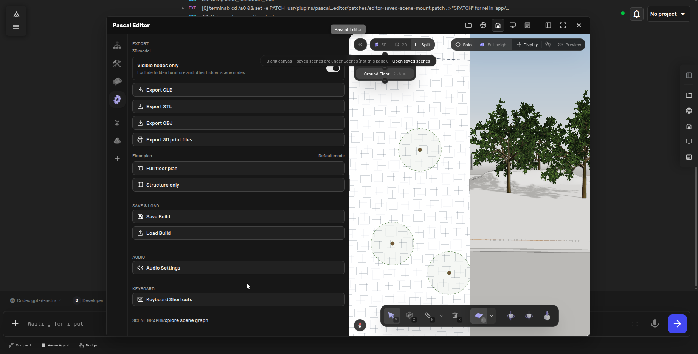

# Pascal Editor

Agent Zero plugin that embeds the open-source Pascal 3D editor in the right canvas, supporting both docked canvas mode and floating modal mode.

## Installation

This **1.2.1 Linux x64** package includes the prebuilt editor runtime and MCP bundle. It requires Agent Zero with plugin and right-canvas support, and Linux x64 inside the Agent Zero runtime. The install hook reuses **Node.js 22.13 or newer** when available, otherwise downloads a checksum-verified Node.js **22.22.0** into the plugin's `.deps/node/` directory. This fallback requires access to `nodejs.org` and never changes system packages. The bundled native libraries target Linux x64; other platforms need their own runtime build.

In Agent Zero's Plugins page, install from this Git repository:

```text
https://github.com/3clyp50/pascal_editor
```

Refresh Agent Zero after installation, then select **Pascal Editor** in the right canvas. The install hook sets up dependencies, starts the editor, and registers its MCP tools automatically. No Execute action or manual setup command is needed.

## Screenshots

### Right canvas



### Nature and split view



### Export



## How it works

- The plugin manages a local Pascal editor runtime inside `runtime/apps/editor`.
- The runtime listens on `127.0.0.1` only.
- A same-origin Flask route at `/pascal/` proxies the runtime into the Agent Zero WebUI.
- The right canvas registers a `pascal_editor` surface, usable docked or as a modal.

## Runtime

The runtime was initially vendored from `@pascal-app/cli` 0.1.5. The embedded editor is now a locally rebuilt Pascal standalone app, based on upstream revision `ab0aa8286a53a063d65c434b0929538890c2b6c1` of https://github.com/pascalorg/editor, with integration and rendering fixes. See `runtime/LICENSE`, `ATTRIBUTION.md`, and the rendering source patches in `patches/`.

### Rendering and window behavior

- The editor fills the dock or modal body, including after resizing.
- The responsive bottom drawer updates the viewer height throughout dragging and snap animations.
- Drawing-buffer resizes no longer restart the frame clock or wait for a trailing resize debounce.
- Dock-divider dragging keeps pointer events in Agent Zero until release.
- Floating windows use Agent Zero's shared drag, resize, viewport-clamping, and focus-mode controls.
- On browsers supporting `Element.moveBefore`, docking and undocking preserve the live iframe document and GPU context. Older browsers fall back to reloading the editor URL; save unsaved work before switching surfaces in those browsers.

After updating the plugin, save any unsaved scene and refresh Agent Zero to load the new UI modules and editor build.

## Bundled MCP and AI editing

Installing this plugin through Agent Zero automatically runs `hooks.py:install()`. It prepares Node.js, initializes the editor and its local storage, validates the bundled MCP distribution, then registers the `pascal_editor` stdio server in Agent Zero's existing MCP settings. No separate chat UI, global npm installation, cloud account, API key, HTTP MCP listener, or persistent MCP daemon is added.

The MCP starts on demand through Agent Zero's normal MCP client. The editor and MCP share `runtime/.data/pascal.db`. Installation/update is rerunnable, preserves unrelated MCP servers and per-server preferences, refreshes Pascal's tool catalog, and rolls back newly written registration if initialization fails. The startup extension calls the same hook to restore the editor and reconcile registration before the framework's normal MCP initialization. Disabled plugins are not started. Uninstall removes this plugin's MCP registration, stops the editor, and deletes its downloaded `.deps/` dependencies. Shared system Node.js is left intact; bundled editor dependencies are deleted with the plugin directory. **Export/back up saved scenes before uninstalling: Agent Zero deletes the plugin directory, including its scene database.**

### Using it

1. Open or create a **saved scene** through Pascal's existing Scenes page, or ask Agent Zero to create one with MCP. The initial blank-canvas page is not a database-backed scene.
2. Ask Agent Zero to edit that scene by its name or ID. For example: “In my Kitchen scene, add a door to the north wall.” The agent should list/inspect scenes first if the target is ambiguous.
3. Open the same saved scene in the Pascal canvas. Changes are saved and streamed into that view, whether docked or modal. MCP does not automatically select a browser tab or navigate the iframe.

Agent Zero currently starts a fresh stdio session per tool call. The bundled adapter therefore requires `sceneId` on scene-editing/query tools, loads the target for every call, and persists changes. Lifecycle tools such as `load_scene` use their advertised `id` field. `expectedVersion` can guard against stale edits; concurrent writes are version-checked. There is no implicit scene selection shared across chats. Save manual work before asking for AI changes; this is not a collaborative merge/CRDT editor.

### Scope and limits

- 40 exposed MCP tools include scene/project operations, walls, rooms, doors, windows, furnishings, queries, validation, JSON export, and templates.
- Process-local `undo`/`redo`, AI-sampling `photo_to_scene`, and the upstream headless `export_glb` placeholder are deliberately not exposed. Browser-side manual features are unchanged.
- The local store maintains a current saved graph; do not assume hosted Pascal account permissions or durable checkpoint history. Agent Zero's MCP tool-access policies still apply.
- Pascal's MCP server edits Pascal scenes; it does not turn Pascal into a client for arbitrary external MCP servers.
- The launcher rejects calls while the plugin is toggled off or `mcp_enabled` is false. A previously cached catalog may still appear until MCP settings are refreshed. To disable only AI access, use Agent Zero's existing MCP server/tool toggles; the install hook preserves those choices.

### Building and verification

End-user installation uses the prebuilt `mcp/dist/` bundle and does **not** run npm. Only a missing or outdated Node.js requires a download through `hooks.py`. To rebuild it as a developer, run `npm ci --ignore-scripts --no-audit --no-fund` followed by `node build.mjs` inside `mcp/`. Exact dependencies are pinned in `package-lock.json`; Zod 4.3.5 is pinned for compatibility with the published Pascal core schemas. Retain the generated dependency inventory and full license notices with the bundle. See `ATTRIBUTION.md`.

From `/a0`, run `/opt/venv-a0/bin/python -m unittest discover -s usr/plugins/pascal_editor/tests -v`. The tests exercise registration, cleanup, failure rollback, disabled launch, small SSE chunks, and actual MCP calls through Agent Zero's client with isolated scene storage. Browser integration was additionally verified with a temporary room and door, live events, and dock-to-modal handoff. The lifecycle tests also cover dependency installation, checksum rejection, disabled setup, initialization failure, and dependency cleanup.

The portable package must include the editor runtime and `mcp/dist/`, but exclude `.deps`, `mcp/node_modules`, `runtime/.data`, `runtime/.state`, `config.json`, toggle files, caches, and private user data.

## Settings

- `enabled`: enable/disable the plugin UI and runtime access
- `mcp_enabled`: enable/disable bundled MCP access (default true)
- `port`: loopback port for the embedded editor runtime
- `start_timeout_seconds`: maximum seconds to wait for runtime readiness
